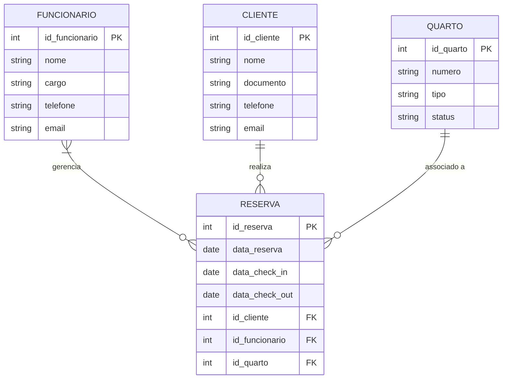

# Projeto de um gerenciador de hotel para a disciplina de Fullstack I das Faculdades Integradas de Taquara.
# Time de devs -> Guilherme Staffen, Thauã Reichert, Rodrigo Machado
# fullstack1-hotel-manager

